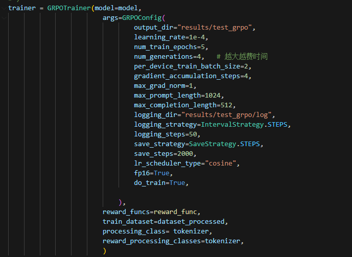
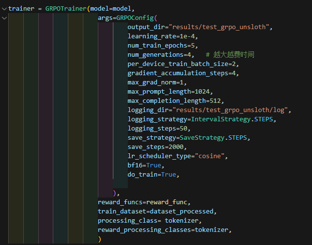

# GPRO实验

## 参数设定

都是LoRA微调切Rank=8，lora_alpha=32

- Without unsloth

- With unsloth

## 资源占用

- Without unsloth

- With unsloth

## 时间花费

- Without unsloth

- With unsloth

## 数据集

SG-KBQA项目中的WebQSP-GenDataset